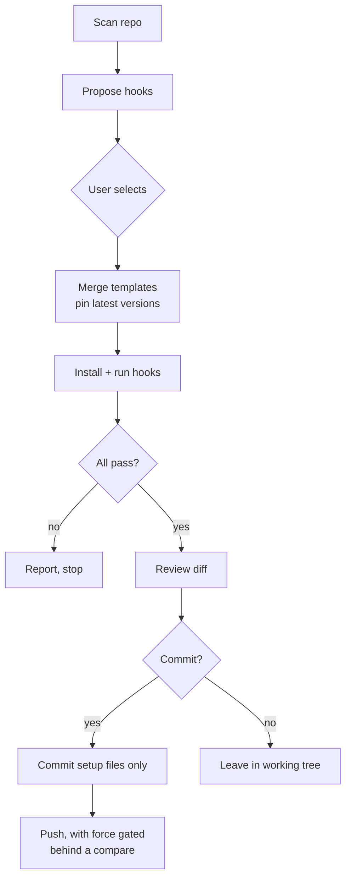

# manage-precommit

A [Claude Code](https://docs.claude.com/en/docs/claude-code) skill that builds a
repository's `.pre-commit-config.yaml` from a small curated catalog — and merges
into an existing config without clobbering what is already there.

Two invariants:

- **Latest, pinned.** Every repo it adds gets the newest release tag, fetched
  live at run time. Nothing is hardcoded.
- **Never clobber.** An existing config keeps its comments, formatting,
  top-level keys, repo `rev`s, and any hooks outside the catalog. Only missing
  pieces are added, and nothing is duplicated.

## Catalog

| Key | Adds | Files written into the repo |
| --- | --- | --- |
| `hygiene` | [pre-commit-hooks](https://github.com/pre-commit/pre-commit-hooks): trailing whitespace, end-of-file, check-yaml, check-json, large files, merge conflicts, mixed line endings | — |
| `yamllint` | [yamllint](https://github.com/adrienverge/yamllint) | `.yamllint.yaml` |
| `markdownlint` | [markdownlint-cli2](https://github.com/DavidAnson/markdownlint-cli2) | `.markdownlint.yaml` |
| `mermaid-parse` | local hook parsing fenced `mermaid` blocks with Mermaid's own parser — no browser | `scripts/parse-mermaid.mjs` |
| `mermaid` | local hook rendering fenced `mermaid` blocks with mermaid-cli in a headless Chromium | `scripts/lint-mermaid.mjs` |
| `gitleaks` | [gitleaks](https://github.com/gitleaks/gitleaks) secret scan | — |

Mermaid ships no linter, so both mermaid entries are bundled hooks, and they
check the same fences — pick one. `mermaid-parse` runs Mermaid's own
[`mermaid.parse()`](https://mermaid.js.org/config/usage#syntax-validation-without-rendering)
under [LinkeDOM](https://github.com/WebReflection/linkedom), which stands in
for the DOM it needs, so no browser is involved; it is what the scan
recommends. It catches syntax errors and only those: a diagram that fails only
when it is rendered gets through. `mermaid` renders each diagram with
[mermaid-cli](https://github.com/mermaid-js/mermaid-cli) in a headless
Chromium, and catches those too.

## Platforms

**Linux and macOS.** Not Windows.

The installer itself is cross-platform and CI proves it — `manage-precommit
install` is exercised on Windows and macOS runners every push. The *skill* is
the part that is not: its procedure runs `mktemp`, `rm -f` and `command -v`, and
drives `pre-commit`, which is a POSIX arrangement throughout. Half of it working
is not the half that matters, so the package does not claim the platform.

## Requirements

- [pre-commit](https://pre-commit.com) 4.0+
- Python 3.10+ and `git`. **No third-party Python packages** — the skill is
  installed by symlink and its scripts run under your system `python3`, so
  anything it needed would have to be installed by hand on every machine.
- For the `mermaid-parse` hook: Node.js and npm, nothing else.
- For the `mermaid` hook only: Node.js, plus a Chromium/Chrome the hook's
  `mermaid-cli` can drive (it downloads one on first use if none is reusable).
  In CI, a container, or on a distro that restricts unprivileged user
  namespaces, Chromium's sandbox cannot start — set `MERMAID_LINT_NO_SANDBOX=1`
  to run it without one. Opt-in, because that removes a real boundary around a
  browser rendering text out of the repository. The hook says so itself when it
  hits that failure, and reports it as an environment problem rather than an
  invalid diagram.

## Install

Works under **Claude Code**, **Codex** and **GitHub Copilot CLI**. Both routes
install a **symlink**, never a copy — so there is only ever one set of files,
and nothing can drift out of sync.

`manage-precommit install` detects which of the three are on this machine and
links the skill where each one looks:

| Agent | Skills directory |
| --- | --- |
| Claude Code | `~/.claude/skills/` |
| Codex | `~/.agents/skills/` |
| GitHub Copilot CLI | `~/.agents/skills/` |

Codex and Copilot read the same directory, so installing for both writes **one**
link, not two of the same name. `--agent NAME` (repeatable), `--all` and
`--dest DIR` overrule the detection; `--dry-run` prints what would happen,
refusals included.

### As a package

```bash
pipx install manage-precommit
manage-precommit install
```

The package is an installer and nothing else; all the work lives in the skill
files it links. `--dry-run` prints what would happen, refusals included;
`--dest DIR` overrules the default location; `--force` acts on something that
is not ours. `manage-precommit uninstall` removes the links and leaves the package alone --
and it sweeps every directory it could have written to, not just the detected
ones: a link outlives the product that read it, which is exactly when leaving it
behind is worst.

It refuses to touch anything it did not create: a real directory there may be a
hand-written skill, and a link pointing elsewhere is not its to remove.

### From a checkout

```bash
git clone git@github.com:grammy-jiang/manage-precommit.git
cd manage-precommit
make install     # ~/.claude/skills/manage-precommit -> ./src/manage_precommit/skill
make uninstall
```

This links the working tree, so an edit is live on the next Claude Code restart
with no rebuild.

## Usage

Invoke the skill and answer the prompts:

```text
/manage-precommit
```

It scans the repo, proposes hooks (always-on plus ones matching what the repo
actually contains), merges the selection, installs the git hook, runs the suite,
shows the diff, and — only with confirmation — commits and pushes just the
pre-commit setup files.

The engine also runs standalone (`S=src/manage_precommit/skill/scripts`):

```bash
python3 $S/precommit.py --catalog                      # list catalog keys
python3 $S/precommit.py --dir /path/to/repo --detect   # inspect existing config
python3 $S/precommit.py --dir /path/to/repo --recommend  # what the repo calls for, and why
python3 $S/precommit.py --dir /path/to/repo --force \
    --templates-file keys.txt --facts-out /tmp/facts.json
```

## How a run flows



## Layout

```text
src/manage_precommit/skill/SKILL.md       the procedure Claude Code reads
                    skill/scripts/precommit.py  catalog, detect, recommend, merge, verify
                    skill/scripts/gitwork.py    status, commit, push-plan, push, facts
                    skill/scripts/config.py     the config scanner and additive writer
                    skill/scripts/summary.py    the end-of-run summary
                    skill/scripts/shared.py     sanitiser, no-follow reader, JSON contract
                    skill/templates/            one YAML fragment per catalog entry
                    skill/assets/               files copied into the target repo
                    skill/references/           on-demand detail (force-push, worked example)
tests/                                     pytest suite
```

The checkout and the installed tree are the same paths: nothing is remapped, so
a path in a traceback traces back here by relative position.

## How the merge keeps its promise

Each catalog entry is a YAML fragment with a `__REV__` or `__NPM__` placeholder.
The engine substitutes the latest upstream version and **inserts the fragment as
text** — it never re-emits the file. Every byte outside an inserted block is
carried across untouched, and the write is rejected unless the original can be
reconstructed from the result by deleting exactly the blocks that were added.

Reading is a strict line scanner rather than a YAML library. It refuses anything
it cannot prove it understands — anchors, aliases, merge keys, flow sequences
where a block is expected, more than one document, tabs — and says which line.
A refusal is an exit code; a guess would be a wrong answer that looks right.

## Dogfooding

This repo uses its own hooks. `scripts/lint-mermaid.mjs` and
`scripts/parse-mermaid.mjs` are symlinks into
`src/manage_precommit/skill/assets/`, so the copies this repo runs and the
payloads it ships to other repos cannot drift apart.

## Development

```bash
pip install -e '.[dev]'
python3 -m pytest        # 119 tests; no test touches the network
python3 -m ruff check . && python3 -m ruff format --check .
python3 -m mypy
```
