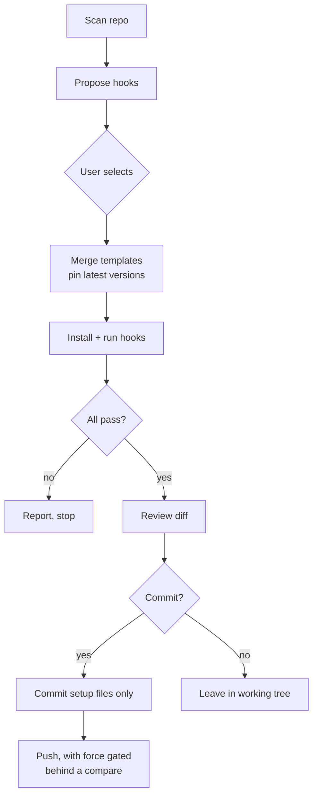

# manage-precommit

A [Claude Code](https://docs.claude.com/en/docs/claude-code) skill that builds a
repository's `.pre-commit-config.yaml` from a small curated catalog — and merges
into an existing config without clobbering what is already there.

Two invariants:

- **Latest, pinned.** Every repo it adds gets the newest release tag, fetched
  live at run time. Nothing is hardcoded.
- **Never clobber.** An existing config keeps its comments, formatting,
  top-level keys, repo `rev`s, and any hooks outside the catalog. Only missing
  pieces are added, and nothing is duplicated.

## Catalog

| Key | Adds | Files written into the repo |
| --- | --- | --- |
| `hygiene` | [pre-commit-hooks](https://github.com/pre-commit/pre-commit-hooks): trailing whitespace, end-of-file, check-yaml, check-json, large files, merge conflicts, mixed line endings | — |
| `yamllint` | [yamllint](https://github.com/adrienverge/yamllint) | `.yamllint.yaml` |
| `markdownlint` | [markdownlint-cli2](https://github.com/DavidAnson/markdownlint-cli2) | `.markdownlint.yaml` |
| `mermaid` | local hook validating fenced `mermaid` blocks | `scripts/lint-mermaid.mjs` |
| `gitleaks` | [gitleaks](https://github.com/gitleaks/gitleaks) secret scan | — |

Mermaid ships no offline linter — its real parser only runs in a browser — so
the bundled hook renders each diagram with
[mermaid-cli](https://github.com/mermaid-js/mermaid-cli) and fails the commit on
a parse error.

## Requirements

- [pre-commit](https://pre-commit.com) 4.0+
- Python 3 with [`ruamel.yaml`](https://pypi.org/project/ruamel.yaml/) — required
  for the comment-preserving merge: `python3 -m pip install --user ruamel.yaml`
- For the `mermaid` hook only: Node.js, plus a Chromium/Chrome the hook's
  `mermaid-cli` can drive (it downloads one on first use if none is reusable)

## Install

Clone the repo and symlink it into your skills directory:

```bash
git clone git@github.com:grammy-jiang/manage-precommit.git
ln -s "$PWD/manage-precommit" ~/.claude/skills/manage-precommit
```

## Usage

Invoke the skill and answer the prompts:

```text
/manage-precommit
```

It scans the repo, proposes hooks (always-on plus ones matching what the repo
actually contains), merges the selection, installs the git hook, runs the suite,
shows the diff, and — only with confirmation — commits and pushes just the
pre-commit setup files.

The engine also runs standalone:

```bash
python3 precommit.py --catalog                        # list catalog keys
python3 precommit.py --dir /path/to/repo --detect     # inspect existing config
python3 precommit.py --dir /path/to/repo --force hygiene yamllint gitleaks
```

## How a run flows



## Layout

```text
SKILL.md            the skill definition Claude Code reads
precommit.py        engine: catalog, detect, generate/merge
render-summary.py   end-of-run summary (color on a TTY, plain when piped)
templates/          one YAML fragment per catalog entry, plus the base skeleton
assets/             files copied into the target repo
```

Each catalog entry is a YAML fragment with a `__REV__` placeholder. The engine
fills it with the latest upstream tag, then merges the result into the target
config with `ruamel.yaml`, which round-trips comments and formatting.

## Dogfooding

This repo uses its own hooks. `scripts/lint-mermaid.mjs` is a symlink to
`assets/lint-mermaid.mjs`, so the copy this repo runs and the payload it ships
to other repos cannot drift apart.
